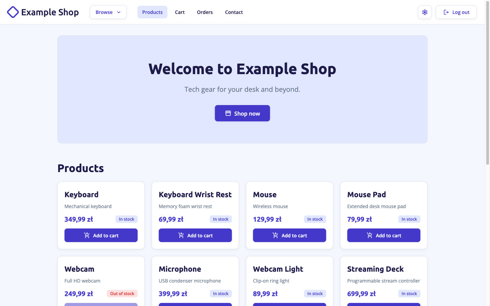
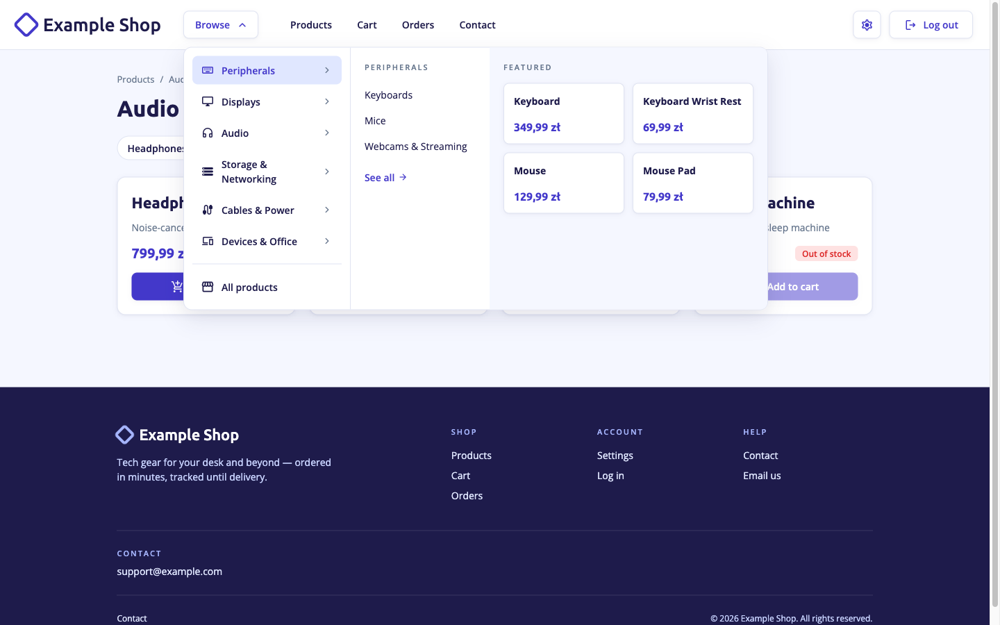
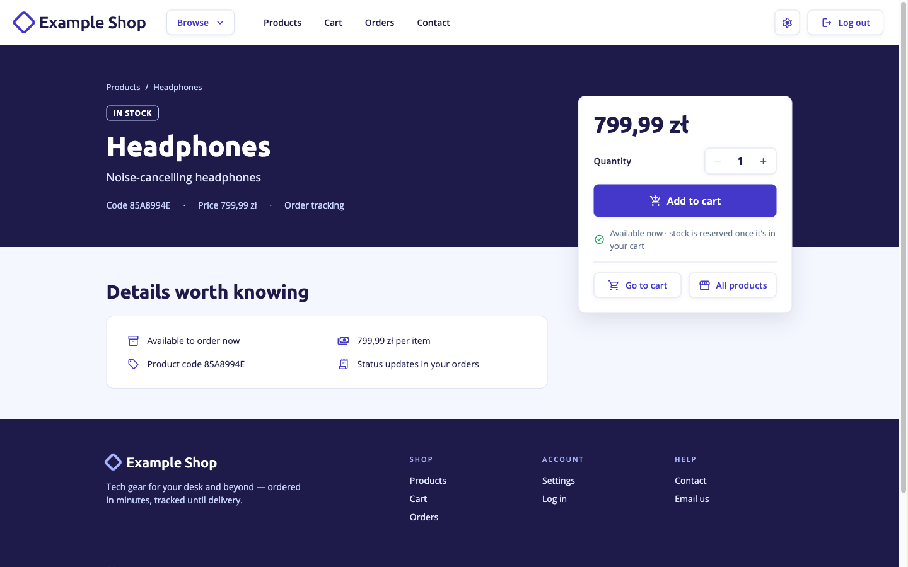
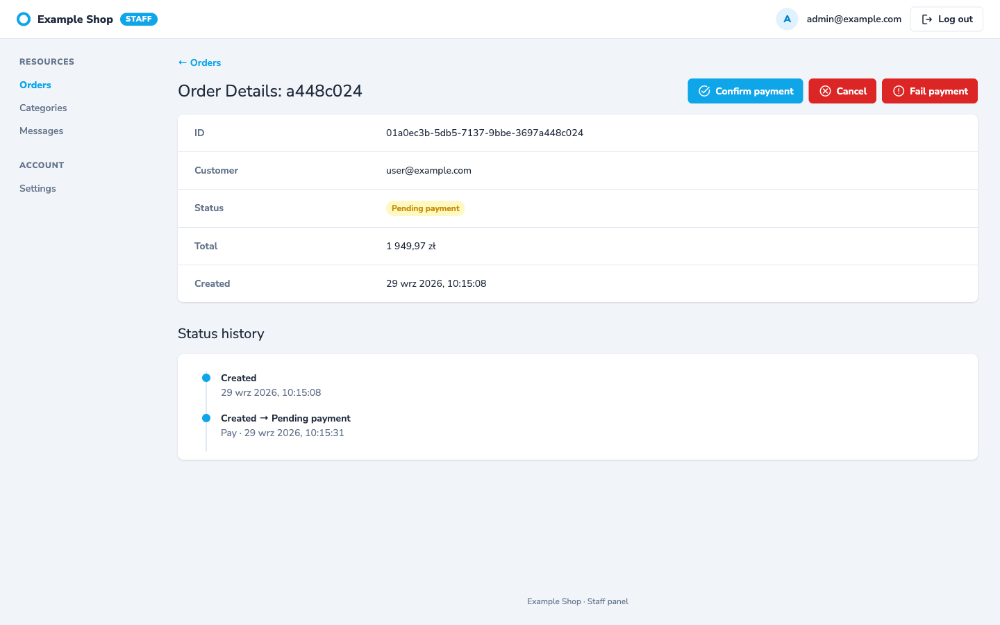

# Symfony Store App

Symfony 8.1, PHP 8.5, MySQL 8.4, Redis 8.10, RabbitMQ 4.3, Angular 22.

## Setup

```sh
scripts/setup.sh
```

- API: http://localhost:8080
- Frontend: http://localhost:4200
- RabbitMQ: http://localhost:15672
- MySQL: `127.0.0.1:13306`

Users (password `password`): `admin@example.com` (`ROLE_ADMIN`), `user@example.com` (`ROLE_USER`).

## Screenshots

| Shop | Category menu |
|---|---|
|  |  |
| **Product page** | **Staff panel (`/admin`)** |
|  |  |

## Tests

```sh
docker compose exec -e XDEBUG_MODE=off php85 php bin/phpunit
```

## Workers

```sh
docker compose exec php85 php bin/console messenger:consume async
docker compose exec php85 php bin/console messenger:consume scheduler_expired_cart
docker compose exec php85 php bin/console messenger:consume events
docker compose exec php85 php bin/console app:outbox:publish --limit=100
```
